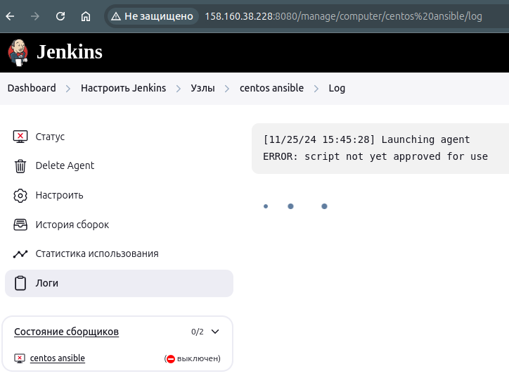
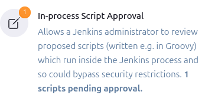
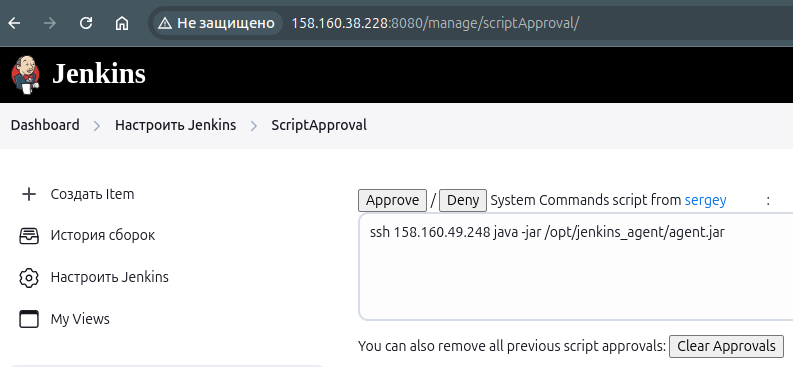
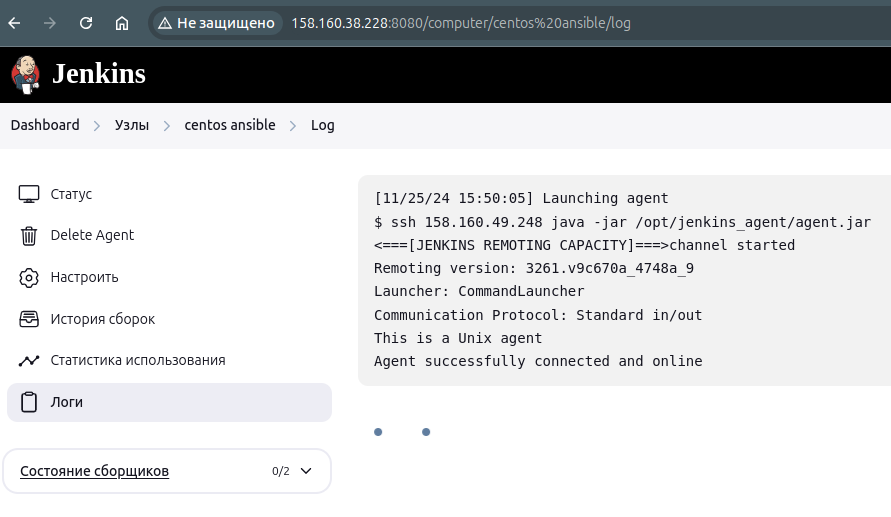
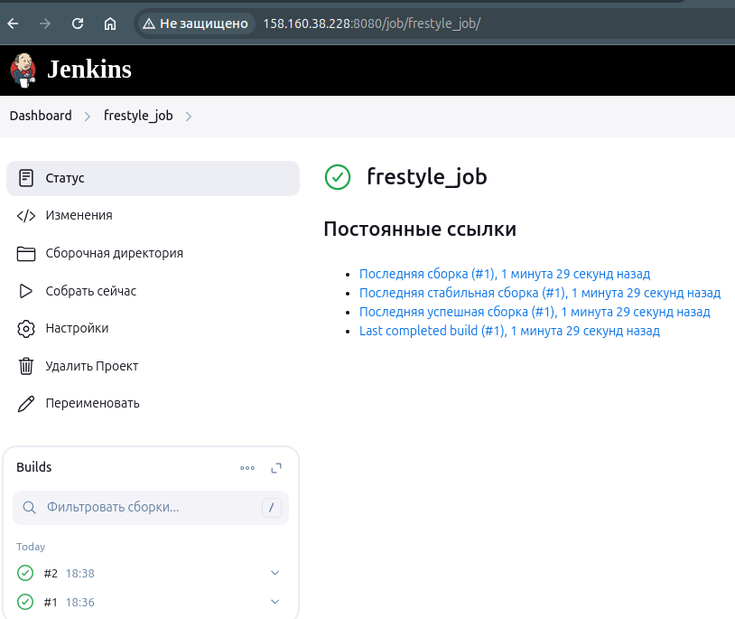
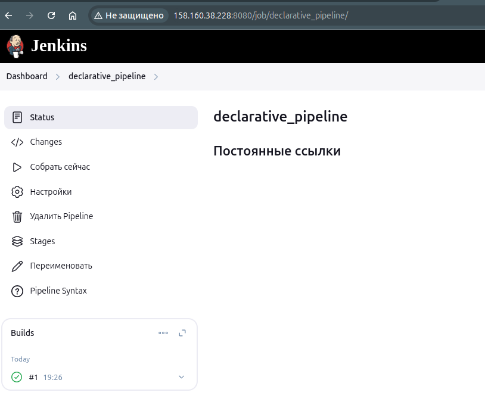
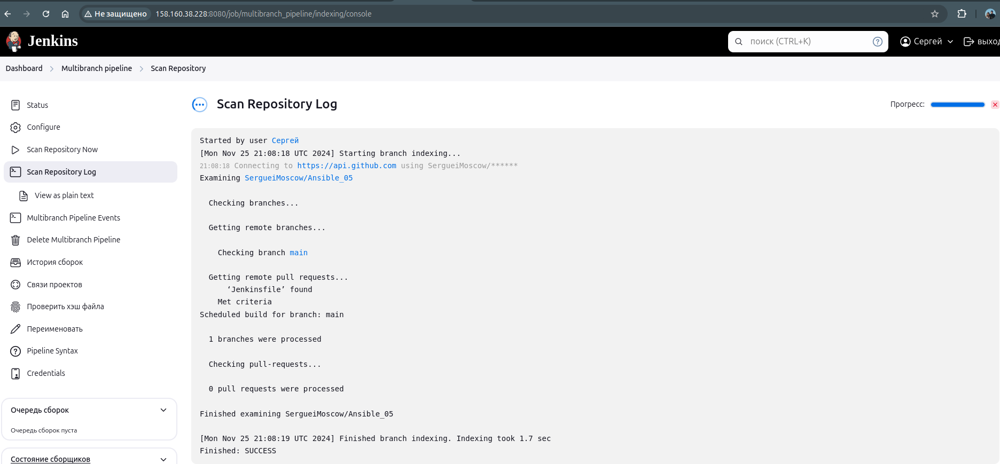
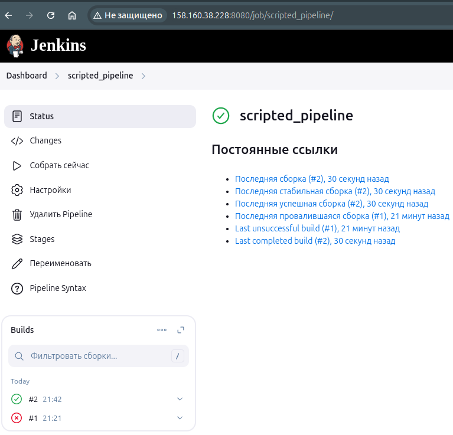
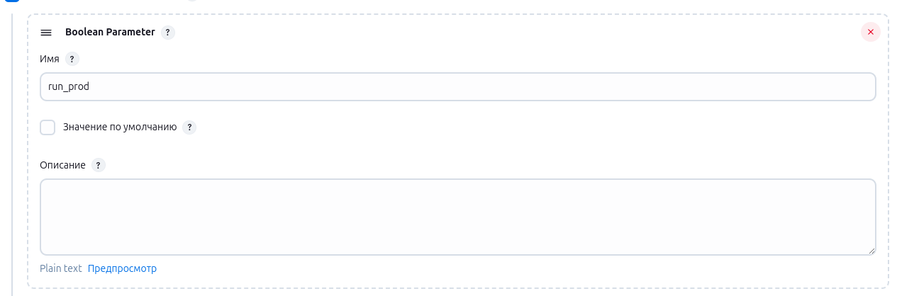

[Задание](https://github.com/netology-code/mnt-homeworks/blob/MNT-video/09-ci-04-jenkins/README.md)

- в [vars](infrastructure/inventory/cicd/group_vars/jenkins.yml) заменяем версию JDK на 17, чтобы избежать ошибки:
```yaml
java_packages:
  - java-17-openjdk-devel
  - java-17-openjdk
```
- В [site](infrastructure/site.yml) task `Install some required` добавить установку pip, иначе следующая таска заваливается.

После этого сайт с jenkins открывается.

- ставим плагин `command-launcher`

- создаём новый Node  

Корневая директория: `/opt/jenkins_agent/`

Команда запусука: `ssh 158.160.49.248 java -jar /opt/jenkins_agent/agent.jar`

- Сразу после создания скрипт не может запуститься, т.к. его нужно аппрувнуть:  


- Скрипт нужно аппрувнуть здесь:  


  
Нажать Approve  

- После этого агент работает корректно:  
  

### Freestyle Job
- Создаём Job Freestyle с таким скриптом:
```bash
if [ -d "Ansible_05" ]; then
  echo "Directory Ansible_05 exists. Performing git pull..."
  cd Ansible_05
  git pull
else
  echo "Directory Ansible_05 does not exist. Cloning the repository..."
  git clone git@github.com:SergueiMoscow/Ansible_05.git
  cd Ansible_05
  python3 -m venv venv
fi
echo "Current directory: $(pwd)"
source venv/bin/activate
pip3 install ansible-dev-tools
pip3 install -U setuptools pip 'molecule'
if [ ! -d "molecule/default" ]; then
  echo "Initializing new Molecule scenario..."
  molecule init scenario default
else
  echo "Molecule scenario directory already exists. Skipping initialization."
fi
molecule test
```
Запускаем, всё сработало:  \


### Declarative pipeline
Pipeline:
```
pipeline {
    agent any

    environment {
        REPO_URL   = 'git@github.com:SergueiMoscow/Ansible_05.git'
        REPO_DIR   = 'Ansible_05'
        VENV_DIR   = 'venv'
    }

    stages {
        stage('Preparation') {
            steps {
                script {
                    if (fileExists(REPO_DIR)) {
                        echo "Directory ${REPO_DIR} exists. Performing git pull..."
                        dir(REPO_DIR) {
                            sh 'git pull'
                        }
                    } else {
                        echo "Directory ${REPO_DIR} does not exist. Cloning the repository..."
                        sh "git clone ${REPO_URL} ${REPO_DIR}"
                        dir(REPO_DIR) {
                            sh "python3 -m venv ${VENV_DIR}"
                        }
                    }
                }
            }
        }

        stage('Install dependencies') {
            steps {
                dir(REPO_DIR) {
                    script {
                        echo "Activating virtual environment and installing requirements..."
                        sh """
                        source ${VENV_DIR}/bin/activate
                        pip install -U setuptools pip
                        pip install molecule
                        """
                    }
                }
            }
        }

        stage('Molecule setup') {
            steps {
                dir(REPO_DIR) {
                    script {
                        if (fileExists("molecule/default")) {
                            echo "Scenario directory molecule/default exists. Removing it..."
                            sh 'rm -rf molecule/default'
                        }
                        echo "Initializing new Molecule scenario..."
                        sh """
                        source ${VENV_DIR}/bin/activate
                        molecule init scenario default
                        """
                    }
                }
            }
        }

        stage('Molecule test') {
            steps {
                dir(REPO_DIR) {
                    script {
                        echo "Executing Molecule tests..."
                        sh """
                        source ${VENV_DIR}/bin/activate
                        molecule test
                        """
                    }
                }
            }
        }
    }

    post {
        always {
            cleanWs()
            echo "Pipeline execution finished."
        }
        success {
            echo "Pipeline successfully executed!"
        }
        failure {
            echo "Pipeline failed!"
        }
    }
}
```
Сработало:  


### Jenkinsfile
- Копируем содержимое pipeline в Jenkinsfile проекта, пробуем - работает
- Модифицируем [`Jenkinsfile`](https://github.com/SergueiMoscow/Ansible_05/blob/main/Jenkinsfile), убираем из него клонирование и pull репозитория, т.к. это уже делает сам Jenkins.

### Multibranch pipeline
- Создаём multibranch pipeline, запускаем:  


### Scripted pipeline
Первый запуск завершился ошибкой:  
[error](images/image08.png)

Добавление строки `jenkins ALL=(ALL) NOPASSWD:ALL` в `/etc/sudoers` решило проблему:


### Изменения в Jenkinsfile
чтобы работал в зависимости от параметра.

Добавляем параметр:  

  

Скрипт сохранён в [`ScriptedJenkinsfile`](ScriptedJenkinsfile)
